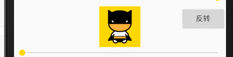
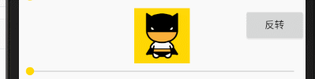
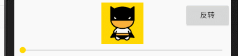
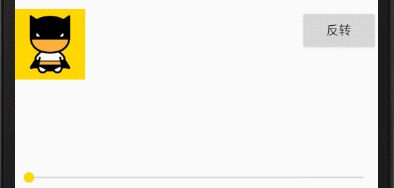
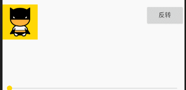
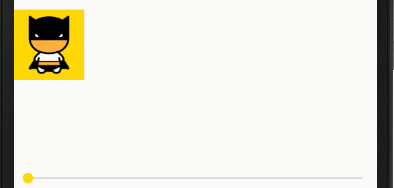
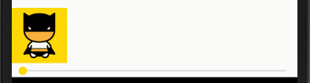
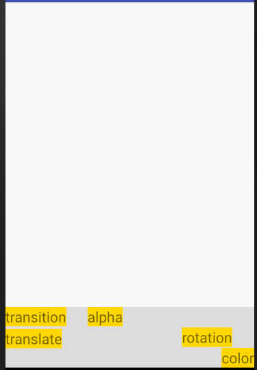
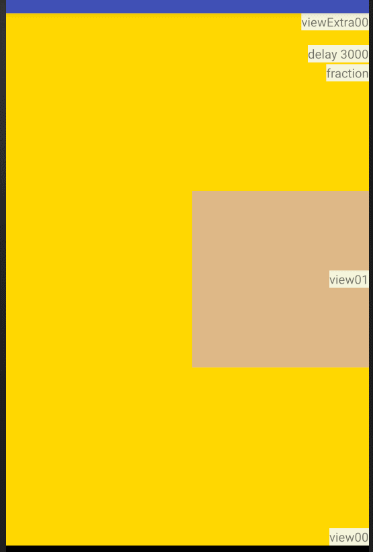

## 一个动画框架

```
implementation 'tech.liujin:transition:1.0.5'
```

### 位移

```
// 将mTranslateImage移动到(600,150)位置
final ViewEvaluator evaluator = new TranslateEvaluator(
    mTranslateImage,
    mTranslateImage.getLeft() + 600,
    mTranslateImage.getTop() + 150
);
```

```
evaluator.evaluate( progress ); //更新进度,进度值0~1
```


### alpha

```
final AlphaEvaluator evaluator = new AlphaEvaluator( mAlphaImage, 0f );
```

```
evaluator.evaluate( progress ); //更新进度,进度值0~1
```


### 改变颜色

```
final Evaluator evaluator = new ColorEvaluator(
    mColorImage,
    getResources().getColor( R.color.gold ),
    Color.RED,
    new ColorApply() {
          @Override
          public void onNewColorEvaluated ( View view, float process, int colorNew ) {
                view.setBackgroundColor( colorNew );
          }
    }
);
```

```
evaluator.evaluate( progress ); //更新进度,进度值0~1
```


### 旋转

```
final Evaluator evaluator = new RotationEvaluator( mRotationImage, 180 );
```

```
evaluator.evaluate( progress ); //更新进度,进度值0~1
```




### x轴旋转

```
final Evaluator evaluator = new RotationXEvaluator( mRotationXImage, 180 );
```




### y轴旋转

```
final Evaluator evaluator = new RotationYEvaluator( mRotationYImage, 180 );
```




### 大小位置同时改变

```
final Evaluator evaluator = new TransitionEvaluator(
    mTransitionImage,
    500,
    50,
    900,
    450
);
```




### 改变多个属性

```
ViewVisionState state = new ViewVisionState(
    500,
    100,
    1000,
    600,
    30,
    0,
    0,
    0.5f
);
final VisionStateEvaluator evaluator = new VisionStateEvaluator( mVisionImage, state );
```



### 使用不完整进度

```
Evaluator evaluator = new TranslateEvaluator(
    mSegmentImage,
    800,
    150
);
final Evaluator segment = new SegmentFractionEvaluator( evaluator, 0.3f, 0.7f );
// 0~0.3进度段进度值将一直为0, 0.3~0.7进度段映射为0~1, 0.7~1进度段一直为1
```




### 使用延迟进度

```
final Evaluator evaluator = new TranslateEvaluator( mDelayImage, 900, 0 );
final Evaluator delay = new DelayEvaluator( evaluator, 2000 ); //延时2s
```




### 配合Animator使用

```
private class UpdateListener implements AnimatorUpdateListener {
      @Override
      public void onAnimationUpdate ( ValueAnimator animation ) {
      
            float animatedFraction = animation.getAnimatedFraction();
            
            mContainerEva.evaluate( animatedFraction );
            mTransitionEvaluator.evaluate( animatedFraction );
            mAlphaEvaluator.evaluate( animatedFraction );
            mTranslateEvaluator.evaluate( animatedFraction );
            mRotationEvaluator.evaluate( animatedFraction );
            mColorEvaluator.evaluate( animatedFraction );
      }
}
```

```
mAnimator = ValueAnimator.ofFloat( 0, 1 );
( (ValueAnimator) mAnimator ).addUpdateListener( new UpdateListener() );
mAnimator.setDuration( 1000 );
```




### SceneManager

根据两个布局,比对相同id的view的显示信息,制作动画

```
mSceneManager = new SceneManager( mRoot, R.layout.activity_scene_end );
```

```
mSceneManager.evaluate( animatedFraction ); // 更新进度
```




